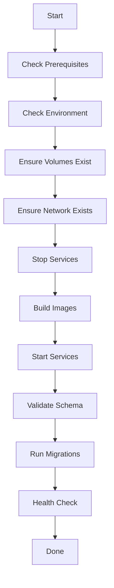

# LLM-Proxy Production Deployment Guide

## 🚀 Quick Start

```bash
ssh openweb
cd /opt/llm-proxy/deployments/docker
./deploy.sh update
```

## 📋 Prerequisites

- Docker & Docker Compose v2 installed
- Server with at least 4GB RAM
- Ports available: 8080, 3005, 5433, 6380, 9090, 9091, 3001
- `.env` file configured in `/opt/llm-proxy/`

## 🔧 Deployment Script

The `deploy.sh` script provides all deployment operations:

### Command Line Usage

```bash
# Full deployment (first time)
./deploy.sh deploy

# Update deployment (rebuild + restart)
./deploy.sh update

# Validate database schema
./deploy.sh validate

# Run migrations
./deploy.sh migrate

# Backup database
./deploy.sh backup

# Show service status
./deploy.sh status

# View logs
./deploy.sh logs [service-name]

# Health check
./deploy.sh health
```

### Interactive Menu

Run `./deploy.sh` without arguments for interactive menu:

```
1. Full Deploy (build + start + validate + migrate)
2. Update Deploy (rebuild + restart + validate + migrate)
3. Start Services
4. Stop Services
5. Restart Services
6. Validate Schema
7. Run Migrations
8. Show Status
9. Show Logs
10. Health Check
11. Show URLs
12. Backup Data
13. Clean Up (DELETES ALL DATA)
14. Exit
```

## 🗄️ Data Persistence

### External Volumes (NEVER DELETED)

All data is stored in external Docker volumes that persist across deployments:

```bash
llm-proxy-postgres-data    # PostgreSQL database
llm-proxy-redis-data       # Redis cache
llm-proxy-prometheus-data  # Prometheus metrics
llm-proxy-grafana-data     # Grafana dashboards
```

**IMPORTANT:** These volumes are marked as `external: true` in `docker-compose.prod.yml` 
and will **NEVER** be deleted by `docker compose down`.

### Verifying Volume Status

```bash
# List volumes
docker volume ls | grep llm-proxy

# Inspect a volume
docker volume inspect llm-proxy-postgres-data

# Check what's using the volume
docker ps --filter volume=llm-proxy-postgres-data
```

## 🔄 Deployment Workflow

The deployment follows this sequence:



### Schema Validation (NEW!)

Before running migrations, the system validates and repairs the database schema:

- Checks all required columns exist
- Validates column types match expectations
- Repairs type mismatches (e.g., INET → VARCHAR)
- Creates missing indexes
- **Fully automated** - runs before every migration

This prevents issues where tables exist but have incorrect schemas.

## 🗃️ Database Migrations

Migrations are located in `/opt/llm-proxy/migrations/` and run automatically:

```
000001_init.up.sql                          # Initial schema
000002_add_content_filters.up.sql          # Content filters
000003_add_filter_matches.up.sql           # Filter matches tracking
000004_add_provider_settings.up.sql        # Provider configuration
000005_add_provider_models.up.sql          # Provider model catalog
000006_add_client_allowed_models.up.sql    # Client model restrictions
000007_add_request_logs.up.sql             # Request logging enhancements
000008_add_request_response_content.up.sql # Request/response capture
000009_fix_missing_request_logs_columns.up.sql # Schema fixes
000010_fix_request_logs_schema.up.sql      # Additional schema fixes
```

### Manual Migration

If needed, run migrations manually:

```bash
cd /opt/llm-proxy/migrations
docker exec -i llm-proxy-postgres psql -U proxy_user -d llm_proxy < 000XXX_migration.up.sql
```

## 🏥 Health Checks

All services have health checks:

```bash
# Backend
curl http://localhost:8080/health

# Admin UI
curl http://localhost:3005/health

# Prometheus
curl http://localhost:9090/-/healthy

# Grafana
curl http://localhost:3001/api/health
```

Container health status:

```bash
docker compose -f docker-compose.prod.yml ps
```

## 🔒 Security

### Secrets Management

Sensitive data in `.env`:

```env
# Database
DB_PASSWORD=<strong-password>

# OAuth
OAUTH_JWT_SECRET=<64-char-base64-string>  # MUST be 64+ characters!

# Admin
ADMIN_API_KEY=<strong-key>

# Providers
ANTHROPIC_API_KEY=<key>
OPENAI_API_KEY=<key>
```

**Generate secure JWT secret:**

```bash
openssl rand -base64 64 | tr -d '\n'
```

### Never Commit Secrets

The `.env` file is in `.gitignore` and should NEVER be committed.

## 🔄 Update Process

### Standard Update

```bash
cd /opt/llm-proxy/deployments/docker
./deploy.sh update
```

This will:
1. ✅ Stop all services (preserves data)
2. ✅ Build new images
3. ✅ Start services
4. ✅ Validate schema
5. ✅ Run migrations
6. ✅ Health check

### Code Update from Git

```bash
cd /opt/llm-proxy
git pull origin main
cd deployments/docker
./deploy.sh update
```

### Rollback

If deployment fails:

```bash
# Check logs
./deploy.sh logs backend

# Restore from backup
cd /opt/llm-proxy/backups/<timestamp>
docker exec -i llm-proxy-postgres psql -U proxy_user -d llm_proxy < postgres_backup.sql

# Restart services
./deploy.sh restart
```

## 💾 Backup & Restore

### Create Backup

```bash
./deploy.sh backup
```

Backups stored in `/opt/llm-proxy/backups/YYYYMMDD_HHMMSS/`:
- `postgres_backup.sql` - Full database dump
- `redis_backup.rdb` - Redis snapshot

### Restore from Backup

```bash
cd /opt/llm-proxy/backups/<timestamp>

# Restore PostgreSQL
docker exec -i llm-proxy-postgres psql -U proxy_user -d llm_proxy < postgres_backup.sql

# Restore Redis
docker cp redis_backup.rdb llm-proxy-redis:/data/dump.rdb
docker compose -f /opt/llm-proxy/deployments/docker/docker-compose.prod.yml restart redis
```

## 🧹 Maintenance

### View Logs

```bash
# All services
./deploy.sh logs

# Specific service
./deploy.sh logs backend
docker logs -f llm-proxy-backend --tail 100
```

### Database Maintenance

```bash
# Connect to database
docker exec -it llm-proxy-postgres psql -U proxy_user -d llm_proxy

# Check table sizes
docker exec llm-proxy-postgres psql -U proxy_user -d llm_proxy -c "SELECT schemaname, tablename, pg_size_pretty(pg_total_relation_size(schemaname||'.'||tablename)) AS size FROM pg_tables WHERE schemaname = 'public' ORDER BY pg_total_relation_size(schemaname||'.'||tablename) DESC;"

# Vacuum database
docker exec llm-proxy-postgres psql -U proxy_user -d llm_proxy -c "VACUUM ANALYZE;"
```

### Clean Up Old Data

```bash
# Delete old request logs (older than 30 days)
docker exec llm-proxy-postgres psql -U proxy_user -d llm_proxy -c "DELETE FROM request_logs WHERE created_at < NOW() - INTERVAL '30 days';"
```

## 🚨 Troubleshooting

### Services Won't Start

```bash
# Check logs
docker compose -f docker-compose.prod.yml logs backend

# Check port conflicts
ss -tlnp | grep -E '(8080|3005|5433|6380)'

# Restart everything
./deploy.sh restart
```

### Database Connection Failed

```bash
# Check PostgreSQL is running
docker ps | grep postgres

# Check PostgreSQL logs
docker logs llm-proxy-postgres

# Test connection
docker exec llm-proxy-postgres psql -U proxy_user -d llm_proxy -c "SELECT 1;"
```

### Schema Validation Errors

```bash
# Run validation manually
./deploy.sh validate

# Check schema manually
docker exec llm-proxy-postgres psql -U proxy_user -d llm_proxy -c "\d request_logs"
```

### Migration Failures

```bash
# Check migration status
docker exec llm-proxy-postgres psql -U proxy_user -d llm_proxy -c "SELECT * FROM schema_migrations ORDER BY version;"

# Run specific migration manually
docker exec -i llm-proxy-postgres psql -U proxy_user -d llm_proxy < /opt/llm-proxy/migrations/000XXX_migration.up.sql
```

## 📊 Monitoring

### Access URLs

- **Backend API:** http://scrubgate.tech:8080
- **Admin UI:** https://scrubgate.tech:3005
- **Prometheus:** http://scrubgate.tech:9090
- **Grafana:** http://scrubgate.tech:3001

### Prometheus Metrics

```bash
curl http://localhost:9091/metrics
```

Key metrics:
- `llm_proxy_requests_total` - Total requests
- `llm_proxy_request_duration_seconds` - Request latency
- `llm_proxy_tokens_used_total` - Token usage
- `llm_proxy_cache_hits_total` - Cache hits

## ⚠️ Important Notes

### Do NOT Do This

❌ `docker compose down -v` - Deletes all data!
❌ `docker volume rm llm-proxy-postgres-data` - Deletes database!
❌ Manual `docker run` commands - Bypasses compose management
❌ Edit `.env` during runtime - Changes won't apply until restart

### Always Do This

✅ Use `./deploy.sh` script for all operations
✅ Create backups before major changes
✅ Check logs after deployment
✅ Verify health endpoints after updates
✅ Keep `.env` secure and never commit it

## 📝 Changelog

### 2026-02-08 - Major Deployment Improvements

- ✅ Added schema validation before migrations
- ✅ Fixed external volumes to prevent data loss
- ✅ Improved deployment script with validation step
- ✅ Added comprehensive documentation
- ✅ Fixed `request_logs` schema inconsistencies

### Previous Updates

- 2026-02-07: Added request/response content capture
- 2026-02-06: Added client model restrictions
- 2026-01-31: Added provider management
- 2026-01-29: Initial production deployment

## 🆘 Support

For issues:
1. Check logs: `./deploy.sh logs`
2. Run health check: `./deploy.sh health`
3. Check service status: `./deploy.sh status`
4. Review this documentation
5. Check GitHub issues

## 📚 Related Documentation

- [Docker Compose Production](docker-compose.prod.yml)
- [Environment Variables](.env.production.example)
- [Migrations](../../migrations/README.md)
- [API Documentation](../../docs/API.md)
